# Versionning using Git

This page explains how to contribute to an ongoing OpenSILEX development and what good practices are recommended within the community.

Summary of this chapter's recommendations :
- you can install **Git** from [https://git-scm.com/](https://git-scm.com/)
- OpenSILEX repositories are hosted on [OpenSILEX GitHub webpage](https://github.com/OpenSILEX/)
- checkout [GitHub guides](https://guides.github.com) recommendations
- create your own branch of the repository you want to contribute to
- clone your branch in order to perform local modifications
- introduce modifications to the code little by little using [GitHub flow](https://guides.github.com/introduction/flow/) :
  1. check if your repository master branch is up-to-date with the master branch of the upstream repository using `git pull upstream master`
  2. make local modifications, add and commit them to your master branch using `git add` and then `git commit`
  3. push to your master branch the commited modifications using `git push origin master`
  4. create a pull request from your repository when it is ready to be merged to the upstream repository

If the concepts of repositories and branches are confusing, go to the [Repositories and branches](#repositories-and-branches) section of this tutorial.

## Requirements

### Installing git

Install the version control system **Git** from [https://git-scm.com/](https://git-scm.com/) or from a terminal, e.g. on a Linux terminal :

```
apt-get install git
```

Super-user priviledge may be required. If so, execute `sudo apt-get install git`.

On Linux, you can check your version of **Git** and display its documentation from the terminal :

```
git --version
git --help
```

These commands can also be used on Windows operating systems through `Git Bash Here`.
When installing **Git** on Windows, make sure you include Git Bash Here in Windows Explorer:

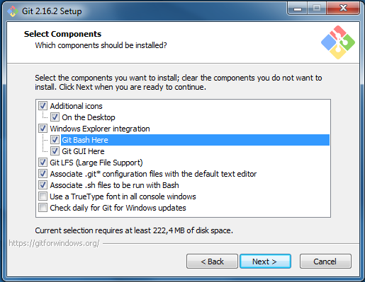

On Windows, open **Git** from any Explorer window with a right-click > Git Bash Here (instead of Git GUI Here) in order to be able to use the commands presented in this documentation.
At the moment, the present documentation provides no information on how to use Git GUI.

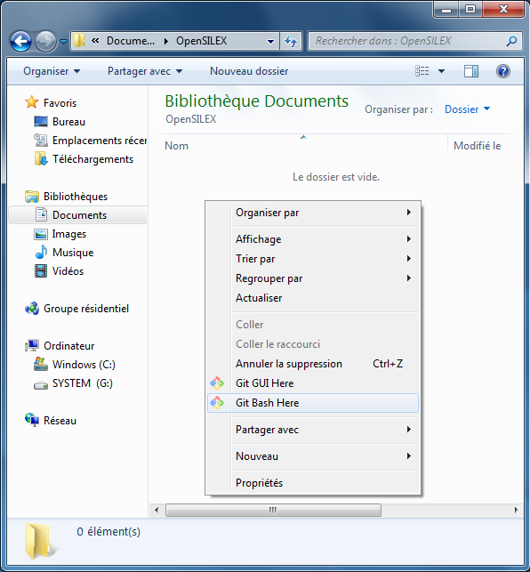

If you are new to **Git**, you can check out this [simple Git guide](http://rogerdudler.github.io/git-guide/index.html) and its associated [Git cheat sheet](http://rogerdudler.github.io/git-guide/files/git_cheat_sheet.pdf), or this other [Git cheat sheet](http://files.zeroturnaround.com/pdf/zt_git_cheat_sheet.pdf).
The [official GitHub guide](https://guides.github.com/activities/hello-world/) is also worth a read.

### Git configuration

The local configuration of Git has to be done only once.
From a terminal (Linux terminal, Mac terminal, or Git Bash Here on Windows), you can indicate your name and your email address with the command lines (without the `<` and `>`) :

```
git config --global user.email "<the email you use on GitHub>"
git config --global user.name "<the name that will appear on the git log>"
```

You can verify your configuration using :

```
git config --list
```

The complete documentation of the Git config command is available on [Git official website](https://git-scm.com/docs/git-config).

### Join GitHub

Create a GitHub profile on [https://github.com/](https://github.com/).

If you are an INRA agent, you have to specify it on your profile, using the `@INRA` tag.
You can find more INRA recommendations regarding the use of GitHub on this [document](http://pfl.grignon.inra.fr/gmpaDocs/INRA_UtiliserForge.pdf) from 2017.

### SSH connexion

You can link your GitHub account to your local **Git** using a SSH key.

Follow the steps in the GitHub help webpage [Generating a new SSH key](https://help.github.com/enterprise/2.12/user/articles/generating-a-new-ssh-key-and-adding-it-to-the-ssh-agent/) for the local generation of a SSH key.

This procedure generates a public key in the text file `/home/<you>/.ssh/id_rsa.pub`. Copy it.

Sign in GitHub and go to [GitHub Settings > SSH and GPG keys](https://github.com/settings/keys).
Click on the `New SSH key` button.

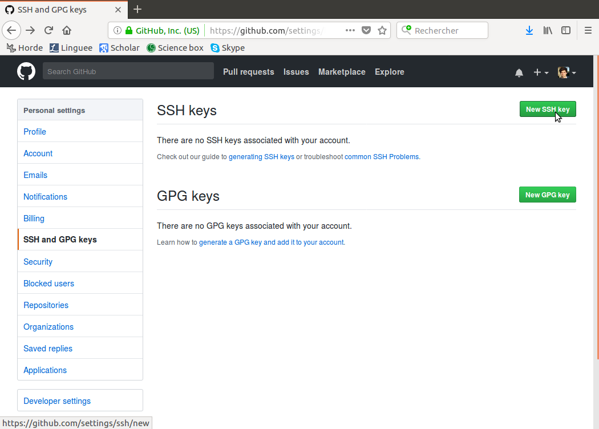

Paste the copied public key in the empty **Key** field.
You can then check if the connection is open from a Linux terminal :

```
ssh -T git@github.com
```

The message `You've successfully authenticated, but GitHub does not provide shell access.` should appear: it works !

Official help pages are listed in the [Connecting to GitHub with SSH](https://help.github.com/articles/connecting-to-github-with-ssh/) webpage.

## Join a development

### OpenSILEX repositories

OpenSILEX development projects are organized in separate repositories.
All OpenSILEX repositories are listed in the [OpenSILEX GitHub webpage](https://github.com/OpenSILEX/).

The present repository, *docs-community-dev*, will be used as an example in this section in order to illustrate how to take part in the collaborative development of an OpenSILEX project.
When collaborating to an other repository, just change *docs-community-dev* displayed in the examples to the name of the repository you are interested in.
Note that the present *docs-community-dev* repository differs from the other repositories since it displays no code, but only a developper-orientated documentation.

When joining an ongoing OpenSILEX development project, there are two initial steps that need to be executed :

1. Create your own branch(es) of the development project's repository by forking it
2. Clone your branch(es) on your computer

### Repositories and branches

As the [first GitHub guide](https://guides.github.com/activities/hello-world/) states, **repositories** are used to organize single projects. They can contain folders and files, images, videos, spreadsheets and data sets, while **branches** are different versions of a repository. By default, a repository has only one branch named `master` which is considered to be the definitive branch.

Let's consider the *docs-community-dev* development project :
- *OpenSILEX/docs-community-dev* is the main repository
- *pierreetiennealary/community-dev* is a repository that I have created when I forked the master branch of the *OpenSILEX/docs-community-dev* repository (you'll notice that it can display a different name, but it is not advised)
- both repository display only one branch each : a main branch named "master"

From my perspective, *OpenSILEX/docs-community-dev* is the "upstream" repository, while *pierreetiennealary/community-dev* is my own repository, which I named locally "origin".

In order to fix a bug or to add a new developments, I can create additionnal branches to my repository.
Once the changes made to these new branches have been completed and checked, the new branches' code is merged into the master branch, and the new branches are deleted.
This procedure is described in [GitHub Flow](https://guides.github.com/introduction/flow/).

### Create a branch

The instructions for creating a branch are available on the official GitHub tutorial : https://help.github.com/articles/fork-a-repo/

First, go with a browser to the URL of the repository you are interested in, e.g. https://github.com/OpenSILEX/docs-community-dev.
From this GitHub webpage, create your own branch of the development project by forking the repository (top-right **Fork** button) :

<!---
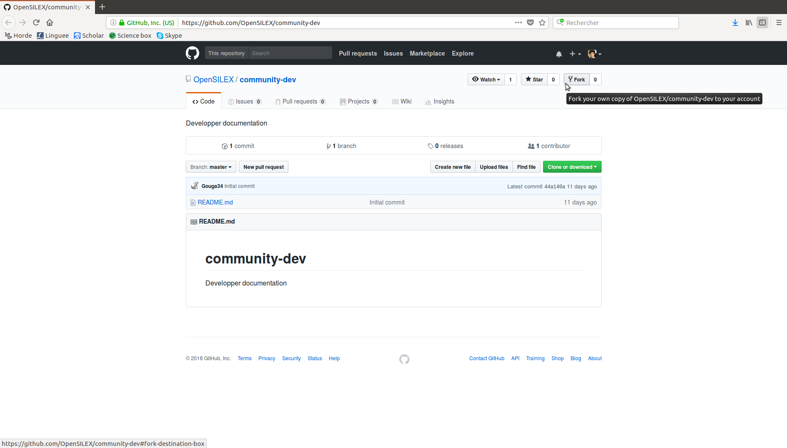
--->


The workflow described in [GitHub guide](https://guides.github.com/introduction/flow/) is the one used in the OpenSILEX community : each additionnal development is made in separate branches forked from a master branch. The changes made in those branches are then integrated to the master branch through pull requests.
When the aim of a new branch has been achieved, e.g. fixing a given bug, the new branch should be pushed to the master branch and then deleted.

Forking the master branch should lead you to your own branch, accessible through GitHub.
In our example, the branch that has been created by forking *OpenSILEX/docs-community-dev* is accessed to through the a new URL of the form `https://github.com/[your_username]/docs-community-dev`.

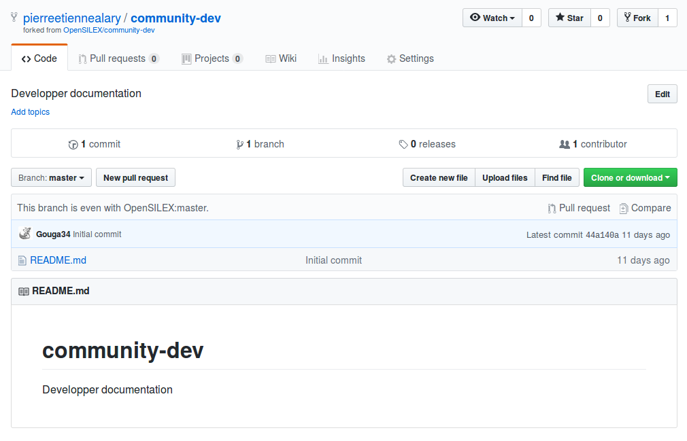

Make sure that you fork the repository owned by OpenSILEX, and not someone else's repository.

### Clone your branch

Then, you want to make a local copy of your branch on your computer.
From your repository's GitHub page, copy the URL of the branch you want to clone by clicking on the green **Clone or download** button, on the right of your own repository webpage.

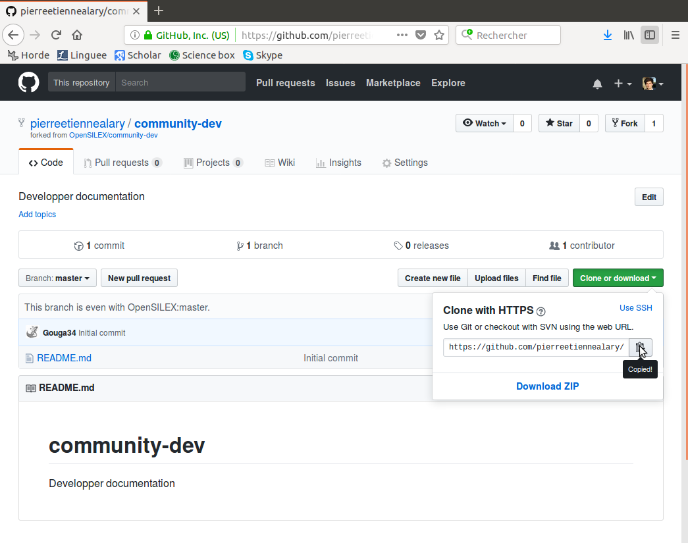

Another option is to download a compressed version of the repository using the **Download ZIP** button below, but the OpenSILEX community strongly advises otherwise.

Choose a local directory on your computer where you want the Git repository to be cloned.
There, you can open a terminal (linux) or Git Bash Here (Windows) and use the `git clone` command.
From an UNIX terminal and using the SSH protocol, the command would be `git clone git@github.com:[your_username]/[repository_name].git`. Using the HTTPS protocol, the command would be `git clone https://github.com/[your_username]/[repository_name].git`.
However, using SSH is preferable to HTTPS (in order not to have to provide your username every time you want to update your branch).

The command `git clone` can be used either with SSH or HTTPS.

The URL to be used after `git clone` can be found by clicking on the green **Clone or download** button of the repository main webpage.
Click on the green **Clone or download** button (and <u>Use SSH</u> if necessary), and copy the remote SSH URL.

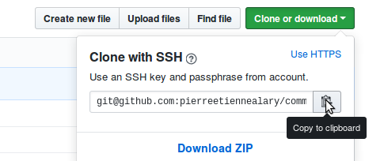

Choose on your computer the directory where you want to create a local copy of the cloned repository.
From this directory, open a terminal (linux) or Git Bash Here (Windows), and then type `git clone` followed by the SSH URL you just copied from GitHub.

```
git clone <copied SSH URL>
```

You haven't configured an SSH connexion yet ? Go to the previous [SSH connexion](#SSH-connexion) section.

The alternative (less recommended) is using `git clone` and then HTTPS :

```
git clone <copied HTTPS URL>
```

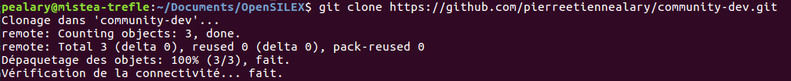

### Manage remotes

The `git remote -v` command gets you the list of the remote repositories.

You can add upstream repositories associated to the list of the remotes using `git remote add <name remote> <path remote>`.
If you choose to name "upstream" (recommended) the main remote repository owned by OpenSILEX, the command line would be :
```
git remote add upstream https://github.com/OpenSILEX/docs-community-dev.git
```

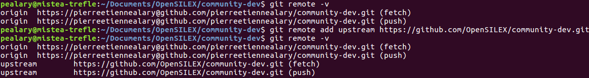

By default, "origin" is the name of the repository you created by forking the OpenSILEX repository (the "upstream" repository).

Complete documentation on how to add a remote is available on GitHub help webpage [Adding a remote](https://help.github.com/articles/adding-a-remote/).
There is also an official documentation for [removing remotes](https://help.github.com/articles/removing-a-remote/).
As with any git command, you can get the official documentation from the shell adding `--help`, as in the example below :

```
git remote --help
```

If you have set up a connexion to GitHub via SSH, as described in the [SSH connexion](#SSH-connexion) section, you might want to change your remote URLs from HTTPS to SSH, as described in the [GitHub documentation](https://help.github.com/articles/changing-a-remote-s-url/#switching-remote-urls-from-https-to-ssh) :
```
git remote set-url origin git@github.com:[your_username]/[repository_name].git
git remote set-url upstream git@github.com:OpenSILEX/[repository_name].git
```


## Edit a development (short)

1. before any modification to your branch, ideally every morning, verify that it's up-to-date with the master branch : `git pull upstream master`
2. add your local modifications to your branch as you edit local files : `git add <modified files>` or `git add *` to add every modified files at the same time without having to name them (not recommended)
3. commit your added modifications : `git commit -m <short and informative message on the changes you made>`
4. idealy every evening, push your commited modifications to your branch : `git push origin <your branch>`
5. when a development is complete, notify the OpenSILEX maintainers to integrate it in the main repository, through a Pull Request you have to open from the GitHub webpage of your own repository

## Edit a development (detailed)

On the local repository cloned from your branch, you can create, read, edit and delete files and folders.
For example, I have created the present file called *github.md*.
The modifications I make locally can be passed on to the master branch of my repository and then to the master branch of the OpenSILEX main repository.

### Checkout, create and delete branches

You can change the branch you are working on using `git checkout <name of the branch>`, e.g. `git checkout master` to see if the master branch is in advance compared to yours.

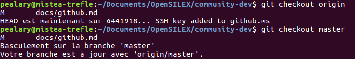

Be carefull when using `git checkout`, since you can also create additionnal branches (not recommanded) using `git checkout -b <new_branch_name>`.
When adding a new branch, the `git branch <new_branch_name>` is preferred.
The difference between the two commands is that `git checkout -b <new_branch_name>` creates a new branch and then switches to the new branch, while `git branch <new_branch_name>` only creates a new branch.

The command `git branch` used without being followed of a character string displays the list of branches of a given repository and specifies on which branch you are (branch whose name is preceded by a \*).

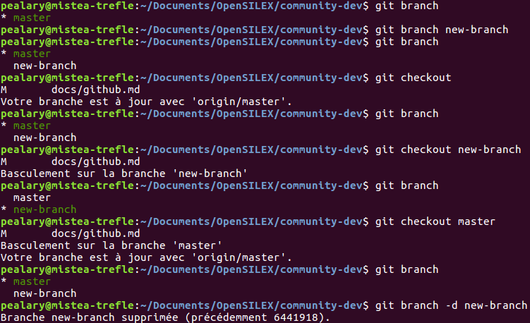

In brief :
- `git branch` lists the existing branches
- `git branch <new_branch_name>` creates a new branch
- `git checkout <new_branch_name>` is used to prepare for working on <new_branch_name>
- `git checkout -b <new_branch_name>` (not recommended) equates to `git branch <new_branch_name>` followed by `git checkout <new_branch_name>`

When deleting a branch, use `git branch -d <branch_name>` followed by `git push origin :<branch_name>` (do not forget the `:` in front of the name of the branch).

### Become up-to-date with a pull

Once you are located on the branch you want to make modifications on, you first need to be sure that you are up-to-date with the master branch of the upstream repository.
Getting the newest developments made on the master branch of the upstream repository is achieved through the following command :

```
git pull upstream master
```

This works only if you have previously named "upstream" the OpenSILEX repository that you have forked (instructions given in the previous [Manage remotes](#manage-remotes) section).

When you use the `git pull` command, make sure that you haven't previously made any new modifications to you branch, otherwise this would be generating conflicts.

### Add changes

After having made modifications to your local repository, you can check which files have been modified using the command `git status`.

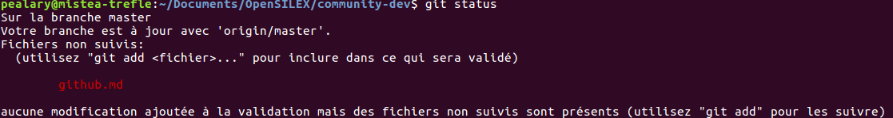

Note that you can use `git status -s` for a shorter answer (less verbose).
If a file appears in red, its means that it has been modified but not yet "added" to the list of files whose changes are to be commited to your branch.

You can visualise line per line the changes you made to a file with `git diff <filename>`.
For example, you would use `git diff github.md` in order to see the changes made to the file *github.md*.

An important step is the selection of the created or changed files whose changes you would like to record to the repository (i.e. commit).
This is achieved by adding changes to the index through the command `git add` followed by the name of the file you created or change (e.g. this markdown document *github.md*).

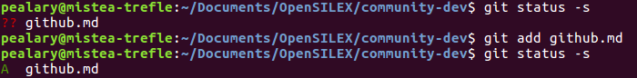

Re-using the `git status` command, the created or changed files added to the index no longer appear in red, but in green : the changes are ready to be committed (i.e. saved in the shared repository).

Note that the command is also `git add` when you remove a file locally and then want it to be removed from the repository.

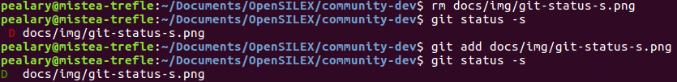

### Commit changes

After being added to the index through `git add`, local modifications are recorded in the git repository through `git commit`.
All the files previously added to the index would then have their modifications passed on the shared repository : in the present example in the master branch of the *pierreetiennealary/community-dev* repository.

The `git commit` commands must be followed by a short message in brackets (itself preceded by `-m`) where is specified as concisely as possible the content of the changes that have been made :

```
git commit -m <short and informative message>
```

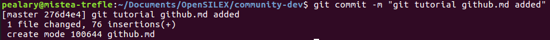

Once the changes have been committed, the concerned files are still displayed in green.

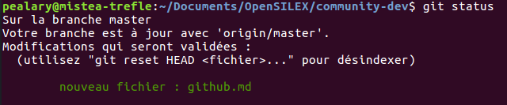

Finally, the command `git log` is used to display all the previous commit that have been made on a given repository.
In order to exit the git log, use the `q` (quit) to exit the log.

### Push changes

The changes made locally needs to be pushed to the origin remote (in my case : *pierreetiennealary/community-dev*).
This is achieved through a `git push` folllowed by the name of the target repository (e.g. "origin") and then of the target branch (e.g. "master").

```
git push origin master
```

A good practice would be to push to the master branch local changes made during the day every evening before leaving the workplace.

### Request your changes to be pulled

The changes pushed to the master branch of the origin remote should be integrated into the upstream repository, *OpenSILEX/docs-community-dev* in our example.
This can be achieved directly from the GitHub page of your own repository through the **New pull request** button.
Maintainers of the upstream repository would then have to accept your pull request.

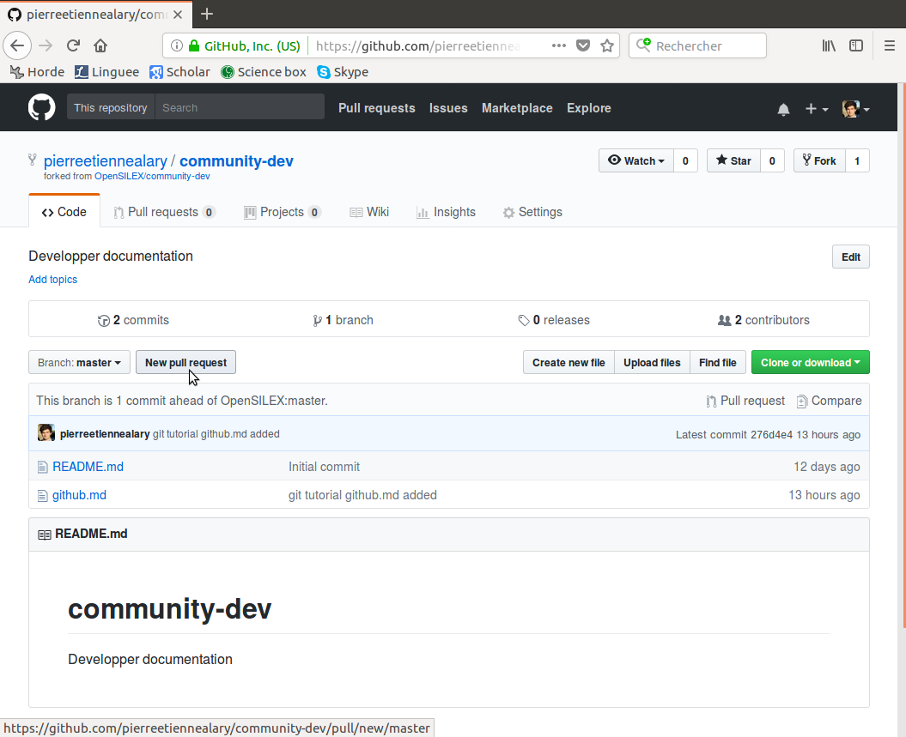

You can then visualise all the changes you made through the **Comparing changes** window.
In order to go on with the pull request process, click on the green **Create pull request** button.

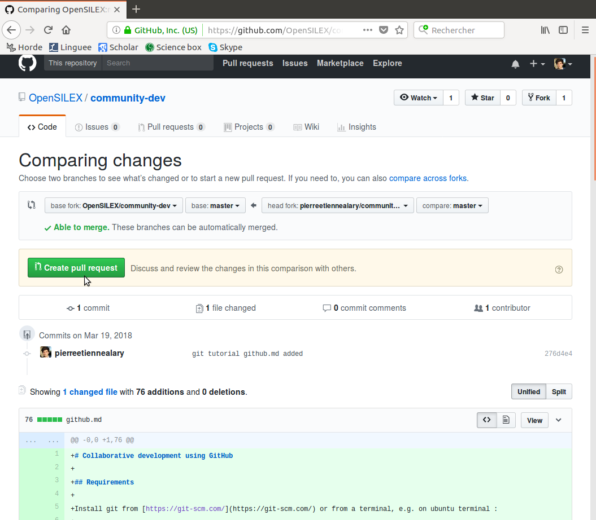

From the **Open a pull request** window, you can name your pull request and add comments if you consider the messages associated with the commits not to be sufficient.

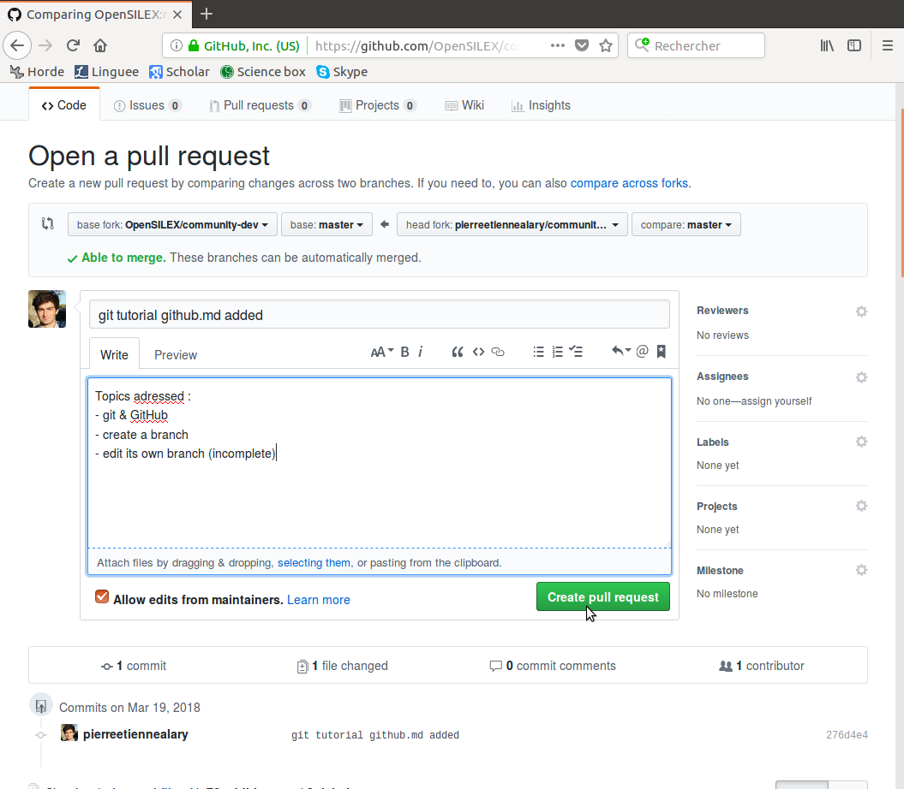

The last step consists in merging the pull request.
If you do not have the authorization to change the OpenSILEX repository, you have to wait for an OpenSILEX maintainer to merge your pull request.

The pull request is closed, either because it has been merge, either because it has been refused.
If a maintainer declines your pull request, she/he states as a comment what was wrong in the changes made.

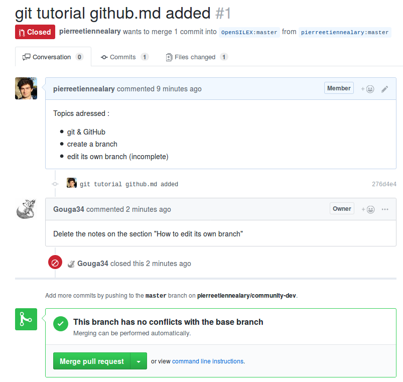

## Good practices

See the Code of Conduct within `Insight > Community` of each OpenSILEX repository for specific indications on how to contribute to each development project.

Concerning the use of git and GitHub, here are the main OpenSILEX recommendations :
- write in English
- follow the official [GitHub flow](https://guides.github.com/introduction/flow/)
- `git checkout` and `git pull upstream master` every morning before working on a development
- check for typos and errors before using `git add` and then `git commit`
- `git push` every evening after working on a development
- create a pull request only when a modification is functionnal
- delete temporary branches after they have been integrated to the master branch of the upstream repository using `git branch -d <temporary.branch.name>` followed by `git push origin :<temporary.branch.name>`
