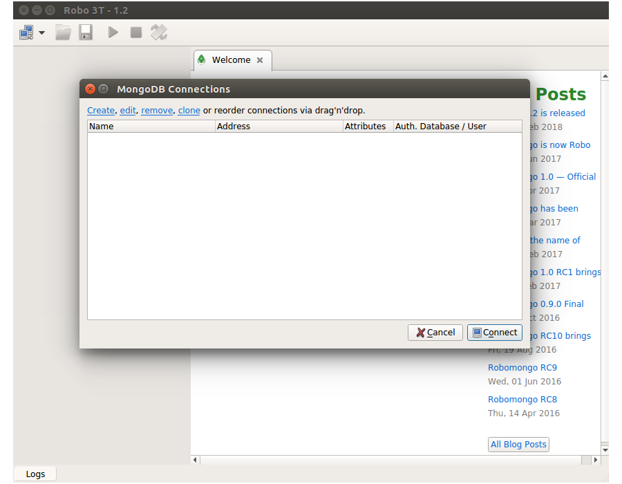
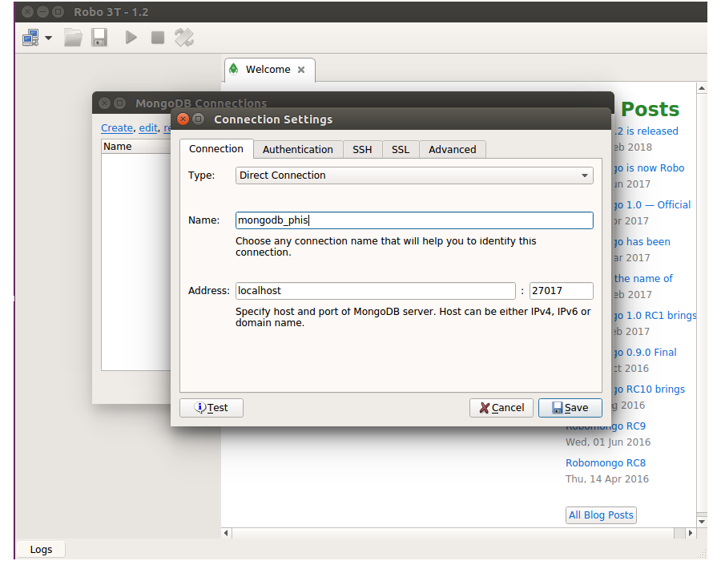
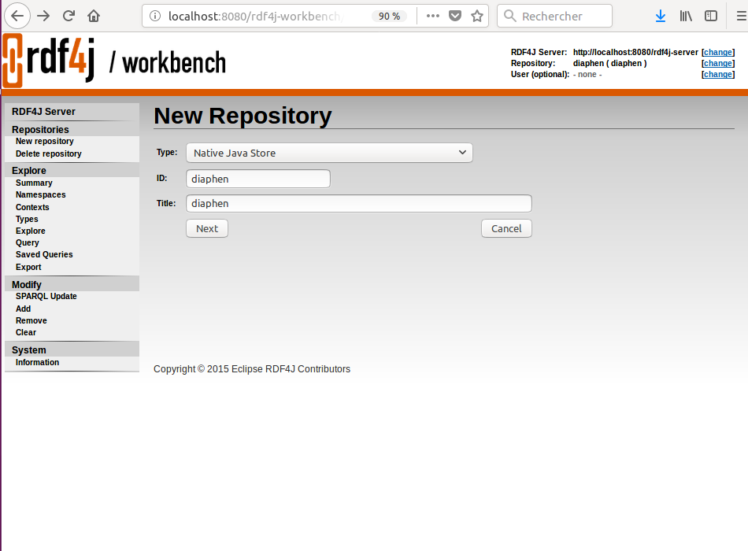
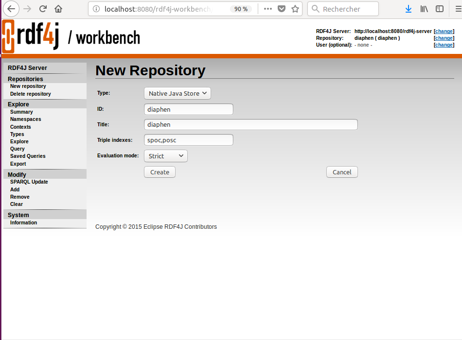
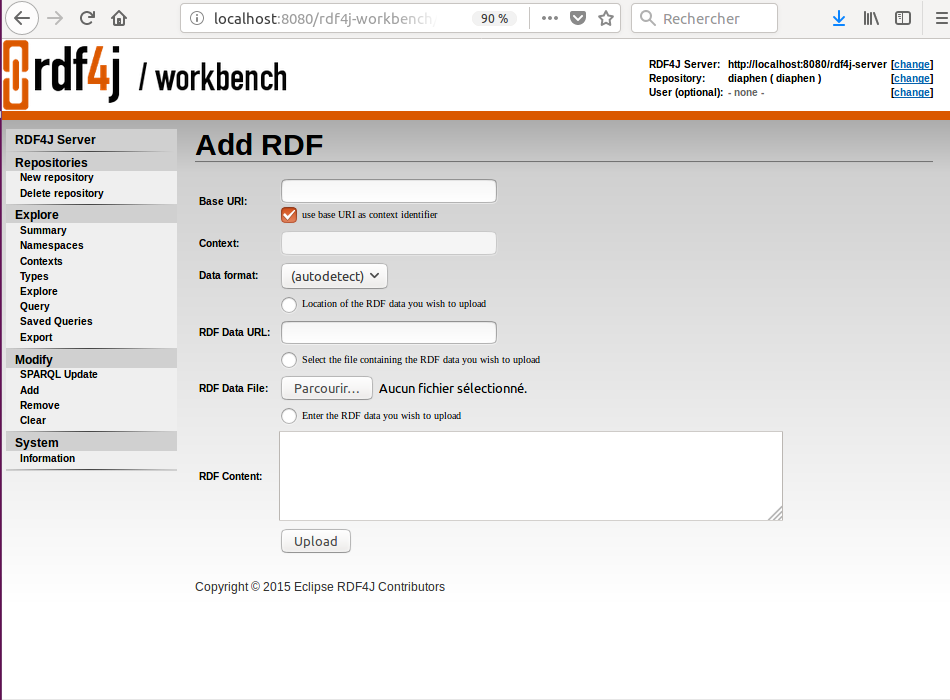

# OpenSILEX PHIS Deployment

1. [Prerequisite](#1-prerequisite)
   * [Hardware](#hardware)  
   * [Software](#software)  
     + [MongoDB and Robo 3T](#mongodb-and-robo-3t)
     + [Netbeans and JDK](#netbeans-and-jdk)
     + [Postgresql and PostGIS](#postgresql-and-postgis)
     + [PHP](#php)
     + [Apache Tomcat and RDF4J](#apache-tomcat-and-rdf4j)
     + [Apache2](#apache2)
     + [Composer](#composer)
     + [Git](#git)
     + [Check install](#check-install)
   * [Files](#files)
     + [Web service folder](#web-service-folder)
     + [Web application folder](#web-application-folder)
     + [Ontology files](#ontology-files)
     + [Database file](#database-file)
2. [OpenSILEX PHIS Installation](#2-opensilex-phis-installation)
   * [MongoDB Database](#mongodb-database)
   * [PostgreSQL Database](#postgresql-database)
   * [RDF4J ontologies](#rdf4j-ontologies)
   * [Web service](#web-service)
   * [Web application](#web-application)
3. [Common errors](#3-common-errors)
   * [Problems with Netbeans](#problems-with-netbeans)
   * [Issues with Composer](#issues-with-composer)
   * [Errors with PostgreSQL](#errors-with-postgresql)
   * [Errors with the web service](#errors-with-the-web-service)
   * [Errors with the web application](#errors-with-the-web-application)
   * [Other problems concerning the web application and the web service](#other-problems-with-the-webapp-and-the-web-service)

## Introduction
This document explains you how to deploy OpenSILEX PHIS on your personnal computer.  
In this document, commands are for **Ubuntu 16.04**. However, the majority of these commands are compatible with all Debian distributions which have the package manager Aptitude.

## 1. Prerequisite

### Hardware
We strongly recommend a server or virtual machines on a compute cloud with :
- Processor: recommended 4 CPU 2.30GHz
- Ethernet connection
- Hard Drive: minimum 500 Go, depending on your data volume.
- Memory (RAM): recommended 32 GB or above

### Software

#### MongoDB and Robo 3T

##### MongoDB
All the information needed to install MongoDB is available at [docs.mongodb.com](https://docs.mongodb.com/manual/tutorial/install-mongodb-on-ubuntu/#install-mongodb-community-edition/).

The new OpenSILEX release (v3.0) requires at least MongoDB v4.0, which could already be used for the previous release (v2.6). The following links describe how to install or upgrade MongoDB for Ubuntu and Debian systems:

- In case of a new installation, please follow: [Install MongoDB 4.0](./MongoDBInstallv4.md)

- In case of an upgrade of a previously installed MongoDB version, please follow: [Upgrade MongoDB from 3.4 to 4.0](./MongoDBUpgradeTov4.md)

You can check your current MongoDB version with:

 ```
 mongod --version
 ```

Now you have a Mongodb service.

Now MongoDB is installed.

**Note 1**<br/>
The path to the database can be changed in the _etc/mongod.conf_ file.

Open the _mongod.conf_ configuration file with any text editor, for instance with gedit: `sudo gedit /etc/mongod.conf`.
You'll see what is the path to the Mongo database (in my case it is _/var/lib/mongodb_):

```
# Where and how to store data.
storage:
  dbPath: /var/lib/mongodb
```

Set mongodb as owner of the MongoDB files, replacing \<dbPath> by the path displayed after _dbPath_:

```bash
sudo chown -R mongodb:mongodb <dbPath>
```

**Note 2**<br/>
In `/etc/mongod.conf` file, you should add line: `fork: true` after

```
# how the process runs
processManagement:*
```

as follows :

```
# how the process runs
processManagement:*
  fork: true
```

This line is not an obligation, in default mode MongoDB runs as fork (i.e. as a deamon) but it is preffered to force it by `fork: true` to be sure.

Every time you change the `mongod.conf` file, you need to restart the `mongod` service:
```bash  
sudo systemctl restart mongod
```
In this document, we use default folder `var/lib/mongodb`  
To run MongoDB, use following command line:
```bash  
sudo mongod --config /etc/mongod.conf
```

##### Robo 3T

Download Robo 3T at [robomongo.org](https://robomongo.org/download).

Extract the downloaded archive (replace `<version>` with your version of Robot3t):
```bash  
tar -xvf ~/Downloads/robo3t<version>  .tar.gz <Robo 3T repository location>
```
Go to Robo 3T repository location:
```bash  
cd <Robo 3T repository location>
```

Run the installation program:
```bash  
./robo3t<version>  /bin/robo3t
```

#### PostgreSQL and PostGIS

##### PostgreSQL and PostGIS installation

##### PostgreSQL Installation
In a terminal, run these commands:
```bash  
 sudo apt-get update
 sudo apt-get install postgresql
 sudo apt-get install postgresql-9.5-postgis-2.2
```

Locate the PostgreSQL client with:
```{bash}
which psql
```

##### PostgreSQL configuration

The configuration files are in the `etc/postgresql/9.5/main` folder.  
To change the port of the service, edit the `postgresql.conf` file:
```bash  
nano /etc/postgresql/9.5/main/postgresql.conf
```
In the `Connection and Authentication` section, replace `port = XXXX` by `port = 5432`.

Then restart the service to take the changes into account:
```bash
sudo systemctl restart postgresql
```

#### Netbeans and JDK

##### Jdk
You can check if Java Development Kit has already been installed (and with which version) from a terminal:
```{bash}
java -version
```

If JDK is already installed you can go to the next section, [Netbeans](#netbeans).

Otherwise, download the JDK 8 sources (e.g. `tar.gz` archive) at [oracle.com](http://www.oracle.com/technetwork/java/javase/downloads/index.html).

Create a JDK folder wherever you want. For example:
```{bash}
mkdir ~/jdk
```

In the created folder, extract the archive with this command:
```{bash}
tar -xvf ~/Downloads/jdk-X.X.X_linux-x64_bin.tar.gz ~/jdk/
```

Once the installation has been completed, make sure that the value of the property `netbeans_jdkhome` of the file `~/netbeans-X.X/etc/netbeans.conf` is `"/usr/lib/jvm/java-8-openjdk-amd64"`.

##### Netbeans
The documentation needed to install Netbeans is available at [netbeans.org](https://netbeans.org/community/releases/82/install.html).
Download the full version of Netbeans at [netbeans.org/downloads](https://netbeans.org/downloads/start.html?platform=linux&lang=en&option=all).

Run the downloaded script:
```bash
sh ~/Downloads/netbeans-X.X-linux.sh
```
Follow the installation steps.

Check that the **PHP** and **Glassfish/JEE** modules are installed from the Netbeans `Tools > Plugins` menu.

Choose your installation folder for Netbeans (here `~/netbeans`) and select the JDK installation folder (in our case `~/jdk`).

You can launch Netbeans from its installation folder by executing the `netbeans` file (in the bin directory):
```{bash}
./bin/netbeans
```

#### PHP
Install PHP 7.0 executing the following commands:
```{bash}
sudo apt-get update
sudo apt-get install php php-mbstring php-dom
```
Check your PHP version from a terminal:
```{bash}
php --version
```

OpenSILEX does currently not support PHP 7.2. Developments are being made to provide this compatibility.

#### Apache Tomcat and RDF4J

##### Apache Tomcat installation
To have a better control on the installation of Tomcat, install Tomcat from sources files (e.g. `tar.gz` archive).  

You can download Tomcat9.0 archive, core distribution, at [tomcat.apache.org](https://tomcat.apache.org/download-90.cgi).

Create an installation folder for Tomcat. We advise you to create the Tomcat folder in `/home` (or /home/<username>/) :

```bash
sudo mkdir /home/tomcat
```

Extract the archive in this folder (replace `<user>` by your user and `<version>` by the version you downloaded):
```bash
cd /home/tomcat/
tar --owner=<user> -xvzf ~/Downloads/apache-tomcat<version>.tar.gz
```

To be consistent with the OpenSILEX PHIS documentation, we recommand you to rename the Apache Tomcat folder so that the version does not appear :
```bash
mv apache-tomcat<version> apache-tomcat
```

With this procedure, Tomcat is not recognized by Ubuntu services control (`systemctl` or `services`). So you need to execute scripts which are in Tomcat `bin` folder (e.g: `startup.sh` to run and `shutdown.sh` to stop). You also need to change rights on files.

##### Apache Tomcat configuration
Tomcat configuration files are located in the `/home/tomcat/apache-tomcat/conf` folder.  
To use Tomcat manager page you need to define an admin user.  
To do that edit the `tomcat-users` file:
```bash
nano /home/tomcat/apache-tomcat/conf/tomcat-users.xml
```
and add lines:
```{bash}
  <role rolename="manager"/>
  <role rolename="manager-gui"/>
  <user username="tomcat-admin" password="azerty" roles="manager, manager-script, manager-gui"/>
```

As stated in the file `tomcat-users.xml`, "do not forget to remove the <!.. ..> [around the role entries]".

To configure port, edit `server.xml`:
```bash
nano /home/tomcat/apache-tomcat/conf/server.xml
```
and replace:

```XML
<Connector port="XXXX" protocol="HTTP/1.1"
              connectionTimeout="20000"
              redirectPort="8443" />
```

by:
```XML
<Connector port="8080" protocol="HTTP/1.1"
              connectionTimeout="20000"
              redirectPort="8443" />
```
You have to allow `encoded slash` in `/home/tomcat/apache-tomcat/conf/catalina.properties`. If you have the line `org.apache.tomcat.util.buf.UDecoder.ALLOW_ENCODED_SLASH=false`, change `false` value by `true`.  
If you don't have this line, add `org.apache.tomcat.util.buf.UDecoder.ALLOW_ENCODED_SLASH=true` at the end of file.

Start the service:
```bash
/home/tomcat/apache-tomcat/bin/startup.sh
```

##### RDF4J

Download archive zip file [rdf4j.org](http://rdf4j.org/download/) and extract it (replace `<version>` by the version downloaded):
```bash
unzip ~/Downloads/eclipse-rdf4j-<version>-sdk.zip -d ~/
```
You can already copy `.war` files to the Tomcat webapps folder:
```bash
cp ~/eclipse-rdf4j-<version>/war/* /home/tomcat/apache-tomcat/webapps/
```

#### Apache2

##### Apache Installation

```bash
sudo apt-get update
sudo apt-get install apache2 libapache2-mod-php7.0
```

##### Apache Configuration

With this installation configuration files are in `/etc/apache2` folder.  
To change the port you need to edit the file `port.conf`:
```bash
sudo nano /etc/apache2/ports.conf
```
change line `LISTEN XX` to `LISTEN 80`.

Restart service apache2:

```bash
sudo systemctl restart apache2
```

#### Composer

Sometimes when installing Composer from the Ubuntu package, it does not run correctly. To avoid any problem, you should install Composer from the Composer installer file via the following command line (**Curl** must be already installed):

```{bash}
sudo curl -sS https://getcomposer.org/installer | sudo php -- --install-dir=/usr/local/bin --filename=composer
```

Maybe you should create a symbolic link between the new version of composer in `/usr/bin` or use the complete command. e.g. php `/usr/local/bin/composer`.

Now install the plugin that you need to use Composer:
```bash
sudo composer global require "fxp/composer-asset-plugin:^1.2.0"
```

#### Git

Git is needed to download the OpenSILEX PHIS's web service and web application. Git is already installed on most Linux native installations but if it is not your case, you can install it as follows:
```bash
sudo apt-get install git
```
Go to the [Using Git](github.md) section of this documentation to check how OpenSILEX developpers use Git.

#### Check install

Check the configuration of Apache2, Tomcat and PostgreSQL servers (nmap must be intalled, if it is not, do not install it because it is only used for checking ports.):
```bash
sudo systemctl start apache2
sudo systemctl start postgresql
/home/tomcat/apache-tomcat/bin/startup
nmap 127.0.0.1
```

The answer should be:
```
PORT     STATE SERVICE
80/tcp   open  http
5432/tcp open  postgresql
8080/tcp open  http-proxy
```
For information:
- `http` is your Apache2 server
- `postgresql` is your PostgreSQL server
- `http-proxy` is your Tomcat server

They are the three services that you need so if the previous command's result is correct, you can continue to the next section [Prerequisite Files](#files).

Otherwise you have two options:  
- remember the differences and ajust for the next steps
- return to the related section ([Tomcat](#apache-tomcat-configuration), [Apache2](#apache-configuration), [PostgreSQL](#postgresql-configuration))

**Note**<br/>
 If you didn't install the programs exactly like in this document, it is possible that configuration files aren't located exactly like us.

### Files

I recommand you to create a folder where you will download all the required files:
```bash
mkdir ~/OpenSILEX
```

#### Web service folder

Get source from GitHub, directly from the `phis-ws` development repository:
```bash
cd ~/OpenSILEX
git clone https://github.com/OpenSILEX/phis-ws.git
```
Preferably, get the source from the last release at [phis-ws/releases](https://github.com/OpenSILEX/phis-ws/releases) (for example, use `git clone --branch 3.0 https://github.com/OpenSILEX/phis-ws.git` if you want to install the release 3.0).

#### Web application folder

Get source from GitHub, directly from the phis-webapp development repository:
```bash
cd ~/OpenSILEX
git clone https://github.com/OpenSILEX/phis-webapp.git
```
Preferably, get the source from the last release at [phis-webapp/releases](https://github.com/OpenSILEX/phis-webapp/releases) (for example, use `git clone --branch 3.0 https://github.com/OpenSILEX/phis-webapp.git` if you want to install the release 3.0).

#### Ontology files

Get the source from GitHub, directly from the `ontology-vocabularies` development repository:
```bash
cd ~/OpenSILEX
git clone https://github.com/OpenSILEX/ontology-vocabularies.git
```
Preferably, get the source from the last release at [ontology-vocabularies/releases](https://github.com/OpenSILEX/ontology-vocabularies/releases) (for example, use `git clone --branch 3.0 https://github.com/OpenSILEX/ontology-vocabularies.git` if you want to install the release 3.0).

#### Database file

Download the database dump file [opensilex_st_dump.sql](assets/opensilex_st_dump.sql).

## 2. OpenSILEX PHIS Installation

### MongoDB database

You only create a connection to a collection.
Run MongoDB:
```bash
sudo mongod --config /etc/mongod.conf
```
Run Robo 3T:
```bash
~/robo3t/bin/robo3t
```
Create a connection:



Configure your connection:



Create your database:
Right click on connection name -> `Create Database` -> enter a name (`phis` in this document).

### RDF4J Ontologies

Go to http://localhost:8080/. You are in Tomcat server home page.

Click on `Manager App`, connect with your  Tomcat user (a default user is configured in the `home/tomcat/apache-tomcat/tomcat-users.xml` configuration file).  

Search `rdf4j-workbench` in the list, if isn't running, click on `Start`)

Click on the `rdf4j-workbench` link.

Click `New repository` and complete as in the picture:



Click `Next` and check if is corresponds to this:



Click `Create`.

You will do these steps many times:  

Now, Click `Add` in the `Modify` submenu.  



Click on the button next to `RDF Data File` in order to select a RDF Data File.

Select the `oeso.owl` file downloaded previously from the GitHub repository [`ontology-vocabularies`](https://github.com/OpenSILEX/ontology-vocabularies/releases).

Add it in the context  `<http://www.opensilex.org/vocabulary/oeso>` with base URI and context fields (check the box "use base URI as context identifier").
Fill the field `Base URI` with a value of the form `<base-url-of-your domain>/vocabularies/oeso`. For example, the development team in Montpellier uses the base URI `http://www.opensilex.org/vocabularies/oeso`. Please use another one if your install your own version of OpenSILEX, for instance `https://www.<your-institution-name>/vocabularies/oeso`.

In the `Data format` field, select `RDF/XML` and then click on `Upload`.

Repeat this operation with the `oeev.owl` file downloaded previously from the GitHub repository [`ontology-vocabularies`](https://github.com/OpenSILEX/ontology-vocabularies/releases), with the `Base URI` (and context) of the form `<base-url-of-your domain>/vocabularies/oeev`.

Add also a new context for the Ontology Annotation (with the `RDF Data File` `oa.rdf` downloadable [here](http://www.w3.org/ns/oa.rdf) and with the `Base URI` value `http://www.w3.org/ns/oa`.

### PostgreSQL database

Connect to Postgre:
```bash
sudo -i -u postgres
```

#### Create the opensilex user

Start the SQL editor:
```bash
psql
```

Run the following commands:
```sql
CREATE USER opensilex;
ALTER ROLE opensilex WITH CREATEDB;
ALTER ROLE opensilex WITH SUPERUSER;
ALTER USER opensilex WITH ENCRYPTED PASSWORD 'azerty';
```

#### Create the database

We recommand to name the PostgreSQL database with your experimental installation's name.
Create the PostgreSQL database with the following command:
```sql
CREATE DATABASE <experimental_installation_name> OWNER opensilex;
```

Exit the SQL connection:
```bash
\q
```

#### Create the PostGIS extension

Connect to the database with the `opensilex` user:

```bash
psql -U opensilex -h 127.0.0.1 -d <experimental_installation_name>
```
and enter opensilex's current password `azerty` when asked.

Finally run these commands to create the extension:
```SQL
CREATE EXTENSION postgis;
select postgis_full_version();
```
If you have an error connecting to the phis user (+ FATAL: authentification peer:), see [Errors with PostgreSQL](#errors-with-postgresql) in the error section.

Exit the SQL editor:
```
\q
```

#### Set up the database

Download the template dump file from this documentation [opensilex_st_dump.sql](assets/opensilex_st_dump.sql) (make sure you download it in a folder where you are fully owner - like the `/var/lib/postgresql/` folder - because of PosgreSQL ownership issue when importing data).

Import data with :
```bash
psql -U opensilex -h 127.0.0.1 <experimental_installation_name> < /var/lib/postgresql/opensilex_st_dump.sql
```

With specific access rights, you can get a dump from the demonstration version:
```bash
# from postres server
pg_dump -O -U opensilex <experimental_installation_name> > opensilex_st_dump.sql
# -O : --no-owner
# -s : only schema
# -h <IP> : postgres host
# -U <user> : user
```

If you need to generate a MD5 password, you can use:
```bash
 echo -n bonjour | md5sum
```

#### Initialising Users
To start using or trying OpenSILEX PHIS, two users are created automatically:
* admin@opensilex.org/admin for administrative rights
* guest@opensilex.org/guest for restricted rights
See [OpenSILEX PHIS user documentation](https://opensilex.github.io/phis-docs-community/) for further explanation on users management and how to add new users.
We recommand you to change the admin password.

Check the [OpenSILEX PHIS user documentation](https://github.com/OpenSILEX/phis-docs-community) for more informations about users (eg. adding other users).

### Web Service

To deploy a web service with Tomcat, you need a war file.  
To generate a war file from a project, the easiest solution is to use Netbeans.

#### Folders

Create directories for images and layers:
```bash
mkdir -p ~/opensilex-ws/documents/instance
sudo mkdir /var/www/html/images
sudo mkdir /var/www/html/layers
sudo chown -R <user>:<user> /var/www/html/images
sudo chown -R <user>:<user> /var/www/html/layers
sudo chown -R <user>:<user> ~/opensilex-ws/documents/
sudo chmod -R 775 /var/www/html/images
sudo chmod -R 775 /var/www/html/layers
sudo chmod -R 775 ~/opensilex-ws/documents/
```

#### Open project

Run netbeans:
```
~/netbeans/bin/netbeans
```
**Note**<br/>
Netbeans frequently meets error when he starts. If you have an error please go to the [common error](#problems-with-netbeans) section.
Make sure that you have correctly installed Netbeans and linked it to java (see the [Netbeans and JDK](#netbeans-and-jdk) section above). 
When Netbeans starts, open the `phis2-ws` project located in the `phis-ws` GitHub project.

If problems are detected in the project: click right on the project name -> `Resolve problems` -> `Resolve`.  
If problems can't be resolved like that please go to the [common error](#errors-with-the-web-service) section.

#### Configuration Files

You don't need to edit your configuration files specifically with netbeans, you can use a classical text editor (nano, vim, gedit...) to edit them.

Maven profiles are used to generate war files with different configurations.

Three profiles exists by default:
- `dev` (default): Profile used for local developpement with default values
- `test`: Profile used for testing purpose with no values by default
- `prod`: Profile used for production with no values by default

Specific profile configurations are defined in the `config.properties` file which is located in `phis2-ws/src/main/<profile name>/`.

Netbeans users: configuration files are located in `~/OpenSILEX/phis-ws/phis2-ws/src/main/profiles {profile name}`.

Profile could be used with the following command line (`-P` option) from a terminal opened at `~/OpenSILEX/phis-ws/phis2-ws` :

```bash
mvn install -Ptest
```

With no `-P` option, `dev` profile is used.

**Note**<br/>
If you use netbeans to deploy war file in the Tomcat server, the default port is **8084** but in this document we choose to deploy ourselves our war files so the port need to be the Tomcat service port **8080**.  
The choice of deploying ourselves our war files is justified by the universality of the procedure. Netbeans is heavy and some pc can have difficulty to run it and other softwares at the same time.
Using Netbeans enables you to deploy more quickly.

**Warning**

Every time you use the localhost address, you need to use the IP address `127.0.0.1` and not the name `localhost`.

Edit the file `config.properties` of the `dev` profile (you have to adapt values between `< >`).
You need to change the port with the value chosen for Tomcat (in our case 8080):

```properties
# MongoDB configuration
mongo.host=127.0.0.1
mongo.port=27017
mongo.db=<experimental_installation_name>
mongo.user=opensilex
mongo.password=azerty
mongo.authdb=opensilex

# PostgreSQL configuration
pg.host=127.0.0.1
pg.port=5432
pg.db=<experimental_installation_name>
pg.user=opensilex
pg.password=azerty

# RDF4J Configuration
rdf.host=127.0.0.1
rdf.port=8080
rdf.path=rdf4j-server
rdf.infra=opensilex
rdf.repo=opensilex

# Webservice configuration
ws.log.dir=/home/tomcat/apache-tomcat/logs/opensilex-ws

ws.host=127.0.0.1
ws.port=8080
ws.target=phis2ws
ws.baseUrl=rest

ws.doc.host=127.0.0.1
ws.doc.port=8080
ws.doc.name=phis2ws

ws.updir.host=127.0.0.1
ws.updir.user=<Linux session name>
ws.updir.password=<Linux session password>
ws.updir.doc=~/opensilex/documents/instance

ws.images.dir=/var/www/html/images
ws.images.url=http://127.0.0.1/images

ws.layers.dir=/var/www/html/layers
ws.layers.url=http://127.0.0.1/layers
```

#### Generate WAR file

When all configuration files are correctly set up you can generate the `.war` file: right click on the project's name -> `Build with depedencies`.
The `.war` file is generated in `<phis-ws git repository>/phis2-ws/target/phis2ws.war`.

Every time you will change source files, such as the configuration file, you will need to generate and deploy once again the `.war` file.

#### Deploy war file

Copy the WAR archive into the Tomcat `webapps` folder (replace `<>` with the right phis-ws git repository and the Tomcat version):
```bash
cp <phis-ws git repository>/target/phis2ws.war /home/tomcat/apache-tomcat/webapps/phis2ws.war
```

#### Check web service

Your web service is directly deployed. You can check that at http://127.0.0.1:8080/ (it is necessary not to use `localhost`).

On the Tomcat server home page, click on `Manager App` and connect with the Tomcat user.  
Search `phis2ws` in the list (if it isn't running, click on `Start`) and click on the name `/phis2ws`.  
You are now on your web service! if it is correctly set up, you have 2 operationnal links.  

**Note** </br>
You can directly go on the web service with the URL http://127.0.0.1:8080/phis2ws

To check if you have correctly set up your web service :
 - Click on the `Documentation link`
 - Find the line `brapiv1token` and click on it
 - Click on `POST`
 - Click on the example field
 - Click on the `Try it out!` button  

The `Response Code` you get should be:
```
201
```

Otherwise, please go to the [common error](#errors-with-the-web-service) section.

### Web application

#### Folder

The web application deployment is done by Apache2. You have to copy the webapp folder (downloaded from [OpenSILEX/phis-webapp](https://github.com/OpenSILEX/phis-webapp)) in the Apache root folder (in our case `/var/www/html`).
```bash
sudo cp -r <Git folder>/phis-webapp /var/www/html
```
Change the permissions of this folder:
```
sudo chown -R <username>:www-data /var/www/html/phis-webapp
sudo chmod 775 -R /var/www/html/phis-webapp
```
**Note**</br>
`www-data` is the default Apache2 username. But in rare case it can be different. You can check the value of `APACHE_RUN_USER` it in the `/etc/apache2/envvars` file to be sure.

#### Configuration

To deploy the web application in localhost, it isn't necessary to open it with Netbeans:
- Edit `/var/www/html/phis-webapp/config/web_services.php`
- Set the value of `WS_PHIS_PATH_DOC`to `http://127.0.0.1:8080/phis2ws`

To deploy in localhost it isn't necessary to open webapp with netbeans , you only need adapt configuration files so you can use classical editor.  
Netbeans users:  
Open the webapp folder with netbeans, like a php project.

open project ->  `/var/www/html/phis-webapp` -> open  
Configuration files are in: `phis-webapp` -> `Source files` -> `config`  
Other users:  
Configuration files are in: `/var/www/html/phis-webapp/config`  

Edit:
  - *web_services.php*  
Adapt the last lines with the correct URL in our case with:  
```
define('WS_PHIS_PATH', 'http://localhost:8080/phis2ws/rest/');
define('WS_PHIS_PATH_DOC', 'http://localhost:8080/phis2ws');
```

If you are all exactly doing like in this document, it's the only configuration file you need to change. But you can check other configuration files: compare paths and URL with information written in web services configuration files.

#### Composer

Go to your webapp folder:
```bash
cd /var/www/html/phis-webapp
```
Run `composer update`:
```bash
sudo composer update
```
It takes some time.  

It may end in error telling that a PHP package is missing. In this case, install this package:  
```
sudo apt-get install php-<name of the package given by composer>
```
Re-run `composer update`. It may end again in error like previously.

Repeat the steps until it ends successfully.

You may need to change some owner and permission properties of the new files:
```bash
sudo chown -R <username>:www-data /var/www/html/phis-webapp
sudo chmod 775 -R /var/www/html/phis-webapp
```
You should now have an operationnal OpenSILEX PHIS application on your localhost!
Go to http://127.0.0.1:80/phis-webapp and test it by logging in.

If you have any problem, please check the following [Common errors](#common-errors) section.

In the future, to start OpenSILEX PHIS in Localhost, you'll only need to run apache-tomcat service. You can also create an alias using this command :
```
alias phis='apache-tomcat/bin/startup.sh;xdg-open http://localhost/phis-webapp/web'
```

## 3. Common errors

### Problems with Netbeans

+ Exit without error message when starting  

Some ressources are not found or accessible.
Check rights on files/folders in `~/.netbeans/8.2`.
```bash
ls -l ~/.netbeans/8.2
```
To run Netbeans, the owner of all files/folders should be the your username. You can fix it with:
```bash
sudo chown -R <username>:<username> ~/.netbeans
```
Netbeans need also the user to be able to read and write all the files in the folder:
```bash
sudo chmod -R ug+rw ~/.netbeans
```

+ Errors concerned jdk/jre:

Netbeans doesn't find your JDK installation. To fix it, check if you have indicated the correct JDK folder to Netbeans in the `~/netbeans-8.2/etc/netbeans.conf` file (line 57).
If the error persists, your JDK installation may haven't been done correctly. Uninstall JDK and use [this procedure](#jdk) to reinstall.

### Issues with Composer

If you have installed Composer with `apt` from Ubuntu packages, please uninstall Composer (consider deleting the cache and the configuration files in the `~/.cache` and `/etc` folders) and reinstall Composer with [this procedure](#composer), or the official one : [getcomposer.org/download/](https://getcomposer.org/download/), using the following *install-dir* and *filename* options :

```
php composer-setup.php --install-dir=bin --filename=composer
```

If it doesn't fix the problem, please check the [composer troubleshooting page](https://getcomposer.org/doc/articles/troubleshooting.md).

### Errors with PostgreSQL

+ FATAL: authentification peer:  

Edit file `/etc/postgresql/9.5/main/pg_hba.conf` and change the line 90:
```bash
local all all peer
```
by
```bash
local all all md5
```
and restart the service:
```bash
sudo systemctl restart postgresql
```
+ Distance connection impossible

Edit the `/etc/var/postgresql/9.5/main/pg_hba.conf` file.
You need to adapt the values with the correct IP address:
```
hosts all all <ipaddress> md5
```
Edit the `/etc/var/postgresql/9.5/main/postgresql.conf` file and edit the line:
```
listen_addresses: '*'
```
and restart the service:
```bash
sudo systemctl restart postgresql
```

### Errors with the web service

+ Errors with the generation of the WAR file  

In Netbeans, right click on the project name -> `Resolve problems`.

If it detects plugin problems, I recommand you to fix them yourself with the menu : `Tools` -> `Plugins`.
If it appears to be another problem, you can try to fix it with the `Resolve` button.

But if the problem persists, it probably comes from a modification in a project file. You can try to find it, to reopen the project or to remove all the OpenSILEX web service files and reload them).

+ No ressources / 404 or other problems with the web service

Recheck paths and ports in the web service file `services.properties`. If all was done exactly like this:
```
[...]
logDirectory=/home/tomcat/phis2ws/logs

[...]
host=127.0.0.1:8080
basePath=/phisws/rest
[...]
webAppHost=127.0.0.1
webAppPort=8080
[...]
webAppApiDocsName=phis2ws
[...]
webAppApiBasePath=/phis2ws/resources

[...]
uploadFileServerPort=22
# Adresse de sauvegarde des donn\u00e9es
uploadFileServerIP=127.0.0.1
uploadFileServerUsername=<linux session username>
uploadFileServerPassword=<linux session password>
uploadFileServerDirectory=/home/<user>/phis-ws/documents/instance
uploadImageServerDirectory=/var/www/html/images
layerFileServerDirectory=/var/www/html/layers
layerFileServerAddress=http://127.0.0.1/layers
[...]

```
+ Error with test `brapiv1token`

Your database is inaccessible or is wrongly set up.
Check your PostgreSQL server with `nmap` or any tool for port management.
If PostgreSQL isn't running, restart the service:
```bash
sudo systemctl restart postgresql
```
If the service is running but you still have an issue, it comes from the configuration files.
Check paths, URLs and ports in the `service.properties` file and check the URLs, ports and database name in the `opensilex_sql_config` file.

If all these configuration files are correct, it probably is an error in your database.

### Errors with the web application

+ No home page

If your web browser can't access to the home page, it may come from the permissions on the web application files in `/var/www/html/phis-webapp`. Check the permissions with the `ls -l` command line and make changes if something is wrong. You must have all files set up as follows:
```  
owner: <username of your session>
group: <www-data or the name of you apache user>
rights: rwxrwxr-x  
```
To set the files up correctly with the right permissions, run the following commends:
```bash
sudo chown -R <username>:www-data /var/html/phis-webapp
sudo chmod -R 775 /var/html/phis-webapp
```
+ Cannot log in

It can be
- A problem with the configuration file of the web application (`/var/www/html/phis-webapp/config`)
- A problem with the configuration file of the web service
- A problem with the PostgreSQL database.

In your configuration files, check the URLs and ports.
With `psql`, check if your database isn't malfunctionning.

+ GitHub token

If you get an error `GitHub API limit (60 calls/hr) is exhausted...` during the installation of Composer, you need to connect Github and get a Personal access token (see https://github.com/settings/tokens).

#### Other problems with the webapp and the web service

In lots of cases, problems come from configuration files. Check every informations in these files.

When you modify a web service configuration file, you have to rebuild and redeploy the WAR file.
Consider to remove the old version in the Tomcat webapp folder before copying the new version.
<!--stackedit_data:
eyJoaXN0b3J5IjpbLTYzNTc4MjA2NiwtMTcyMzM0Njc1OCwtMT
A5OTg1NTI4MiwtOTUyOTI4MTM4XX0=
-->
